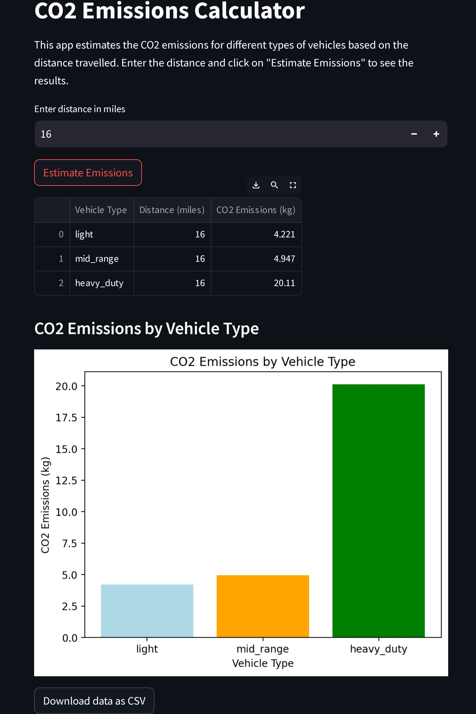

# Vehicle CO2 Emissions Calculator

This project includes a Python script that uses the Climatiq API to calculate CO2 emissions for three types of vehicles over a specific distance. The vehicles considered are light, mid-range and heavy-duty vehicles. This project was commissioned by [marllm.io](https://www.marllm.io/)

## Files Included

- `app.py`: This script creates an interactive Streamlit web app for estimating CO2 emissions. 
            It lets the user input a number and returns a table of data and bar chart displaying this data. 
            You can download this data via the `Download data as CSV` button underneath the chart 

- `output_all_data.py`: This script returns unfiltered emission data.
- `output_sorted_data.py`: This script simply returns a neat table and bar graph.

## Getting Started

To run these scripts, you will need Python and the `requests` library installed. You'll also need an API key from [Climatiq API](https://www.climatiq.io/)

### Prerequisites

- Python
- `requests` library (`pip install requests`)
- Climatiq API Key
- Streamlit (`pip install streamlit`)

### How to Use

1. Clone this repository.
2. Install `requests` and `Streamlit` using pip
3. Insert your Climatiq API key into the script
4. Comment Line 1 in `output_all_data.py`, `output_sorted_data.py` and `app.py` once you've inserted your Climatiq API key.
5. To run the streamlit app, run `streamlit run app.py` in the terminal for app.py. This will start a local server. Open the URL provided in the terminal to interact with your app.

Deployed app link - https://car-co2-emissions-calculator-3eyzgf3dcv7jfdqmans8al.streamlit.app/